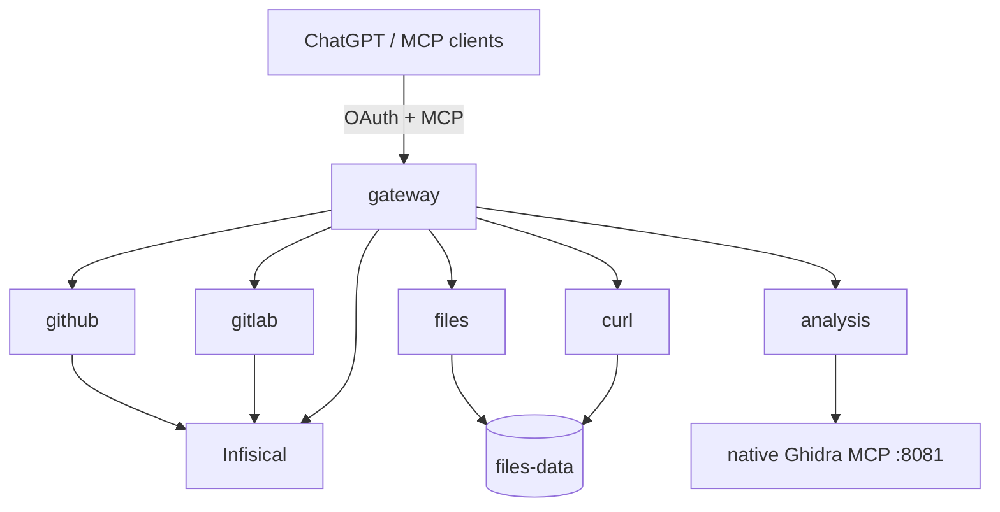

# Architecture overview

MCP Bridge is a small public gateway that composes independent private modules.



## Source ownership

- `bridge` — public OAuth boundary and routing only.
- `common` — provider-neutral runtime, config, secrets, HTTP transport and Git-domain primitives.
- `modules.github` — GitHub-specific API adapters and workflow capabilities.
- `modules.gitlab` — GitLab-specific API adapters and workflow capabilities.
- `modules.files` — persistent content-addressed Files data plane.
- `modules.curl` — structured curl request/download/stream support.
- `modules.analysis` — schema-driven terminology facade over native Ghidra MCP.

GitHub and GitLab may reuse `common` primitives, but neither provider imports the
other. Provider-specific API semantics remain inside the owning module.

Only `gateway` is public. Provider modules remain private Docker services.

## Configuration and composition roots

Process environment is an infrastructure input, not an application dependency. Each
ASGI runtime reads environment-backed settings once while composing the process and
passes immutable typed configuration into stateful clients, stores, policies and
providers. Provider/application code does not call `os.getenv` or mutate process
configuration while handling requests.

`common.settings` owns environment variable names and converts them into focused
configuration objects such as `FileSettings`, `GitHubPolicySettings`,
`GitLabSettings` and `AnalysisSettings`. Secrets bootstrap is configured explicitly
at startup; the only runtime environment lookup outside the composition boundary is
the deliberate `env://...` secret-reference adapter.

This makes service construction deterministic and keeps tests independent from
process-global configuration after bootstrap.

## Public surfaces

```text
/mcp
/github/mcp
/gitlab/mcp
/files/mcp
/http/mcp
/analysis/mcp
```

Raw Ghidra remains a separate native backend. Analysis reads the live Ghidra tool
catalog, exposes behavior-analysis names/descriptions/argument aliases, validates
arguments, and normalizes every call back to the canonical Ghidra tool name and
argument keys before dispatch.
