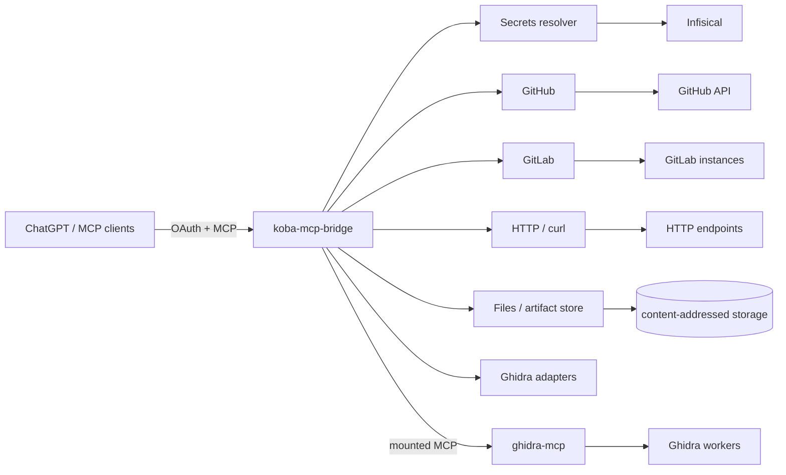
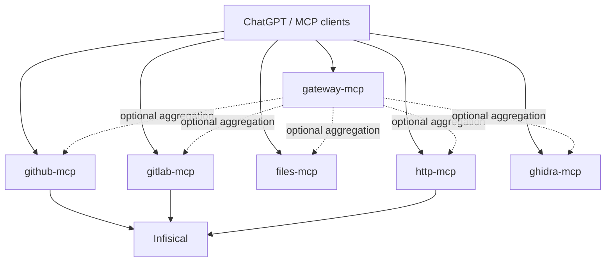

# Architecture overview

## Current platform

The current Koba platform scope is intentionally narrow:

- Secrets;
- GitHub;
- GitLab;
- Ghidra;
- Files/artifact storage;
- HTTP/curl.

Other future platform ideas are explicitly outside the current stabilization pass.

## Stabilization direction

The repository may remain a monorepo, but connector/runtime failure domains should become independent.

The aggregate gateway may remain for compatibility, while dedicated endpoints let a client attach only the capabilities it needs.

## Design principles

- No process-global current account/project/provider state.
- Explicit selectors such as `profile_id` and `project_id`.
- Provider secrets are resolved internally and are never model-visible.
- Infisical machine identities replace scattered provider credentials.
- Connectors should fail and deploy independently.
- Provider-side permissions remain authoritative; Koba adds guardrails.
- Shared libraries are preferred over duplicated provider logic.
- Files are the user-facing concept; immutable artifact IDs can remain an internal/public compatibility primitive.
- Migrations are incremental: old credential env variables remain until each secret reference is accepted in production.
