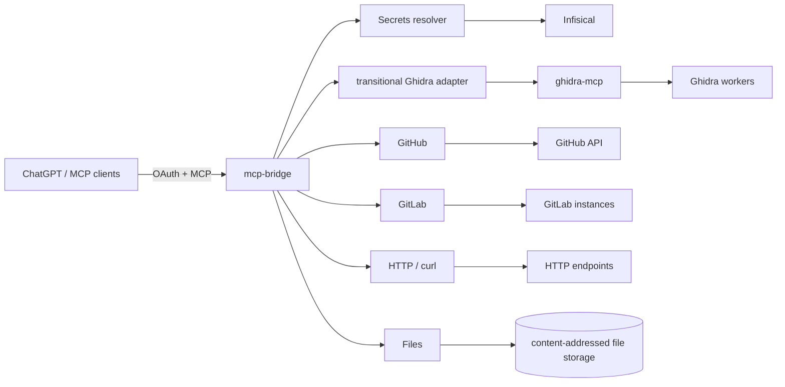
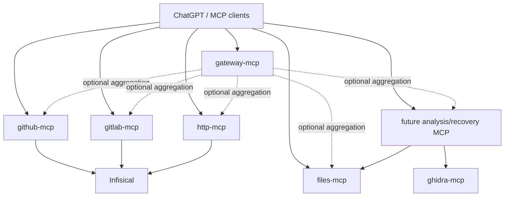

# Architecture overview

## Current platform

The current MCP Bridge platform scope is intentionally narrow:

- Secrets;
- GitHub;
- GitLab;
- Ghidra;
- Files;
- HTTP/curl.

Other future platform ideas are outside the current stabilization pass.

## Stabilization direction

The repository may remain a monorepo, but connector/runtime failure domains should become independent.

Raw `ghidra-mcp` remains a native internal backend. MCP Bridge does not rename or reshape
that backend. A future analysis/recovery MCP will hide Ghidra-specific terminology from
clients and translate MCP Bridge file-oriented operations into the native Ghidra contract.

The aggregate gateway may remain for compatibility, while dedicated endpoints let a
client attach only the capabilities it needs.

## Design principles

- No process-global current account/project/provider state.
- Explicit selectors such as `profile_id` and `project_id`.
- Provider secrets are resolved internally and are never model-visible.
- Infisical machine identities replace scattered provider credentials.
- Connectors should fail and deploy independently.
- Provider-side permissions remain authoritative; MCP Bridge adds guardrails.
- Shared libraries are preferred over duplicated provider logic.
- Files are the canonical MCP Bridge storage concept.
- File identifiers use `file_id = sha256:<digest>`.
- Raw backend vocabulary may remain native behind an adapter boundary.
- Migrations are incremental and must include data migration and rollback planning.
