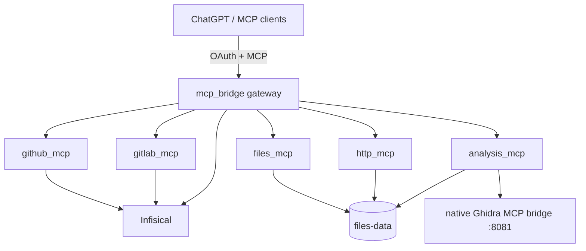

# Architecture overview

MCP Bridge is a monorepo with independent runtime and source-package boundaries.



Only `mcp_bridge` owns the public OAuth boundary and aggregate/dedicated routing.
It does not contain provider clients, Files storage, HTTP implementation, GitHub
workflow logic, GitLab logic, or Ghidra adapter logic.

## Source ownership

- `mcp_bridge` — public gateway only.
- `mcp_common` — shared runtime primitives and secret resolution.
- `github_mcp` — GitHub development/reviewer workflow.
- `gitlab_mcp` — GitLab accounts, repositories, MRs and CI.
- `files_mcp` — persistent content-addressed Files data plane.
- `http_mcp` — structured curl request/download/stream support.
- `analysis_mcp` — Files-oriented analysis boundary over native Ghidra.

Each runtime is a separate Compose service. A failure or restart of one provider
runtime does not require restarting the others.

## Public surfaces

```text
/mcp
/github/mcp
/gitlab/mcp
/files/mcp
/http/mcp
/analysis/mcp
```

Raw Ghidra remains a separate native service and is not renamed or reshaped by this
repository. The current `analysis_mcp` package is the adapter boundary; Ghidra-specific
public vocabulary can be replaced later without modifying the raw backend.

## Design rules

- Provider code must not move back into `mcp_bridge`.
- Shared code belongs in `mcp_common` only when it is genuinely provider-neutral.
- Files are the canonical persistent data model: `file_id = sha256:<digest>`.
- Provider secrets are resolved internally through Infisical.
- No process-global current account/project/provider state.
- Raw backend vocabulary may remain native behind an adapter boundary.
