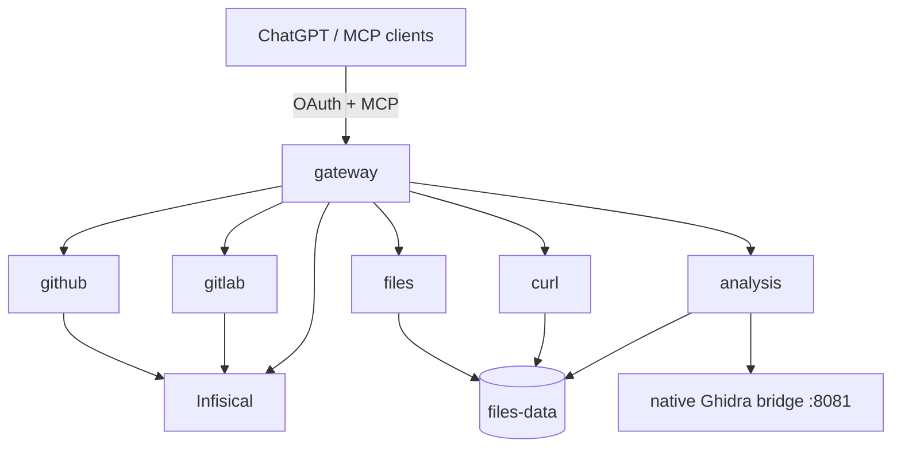

# Architecture overview

MCP Bridge is a small public gateway that composes independent private modules.



## Source ownership

- `bridge` — public OAuth boundary and routing only.
- `common` — shared provider-neutral runtime/secrets primitives.
- `modules.github` — GitHub development/reviewer workflow.
- `modules.gitlab` — GitLab profiles, repositories, MRs and CI.
- `modules.files` — persistent content-addressed Files data plane.
- `modules.curl` — structured HTTP request/download/stream support.
- `modules.analysis` — Files-oriented analysis boundary over native Ghidra.

Only `gateway` is public. Provider modules remain private Docker services.

## Public surfaces

```text
/mcp
/github/mcp
/gitlab/mcp
/files/mcp
/http/mcp
/analysis/mcp
```

Raw Ghidra remains a separate native backend. The analysis module translates between
the Files model and native Ghidra contracts.
