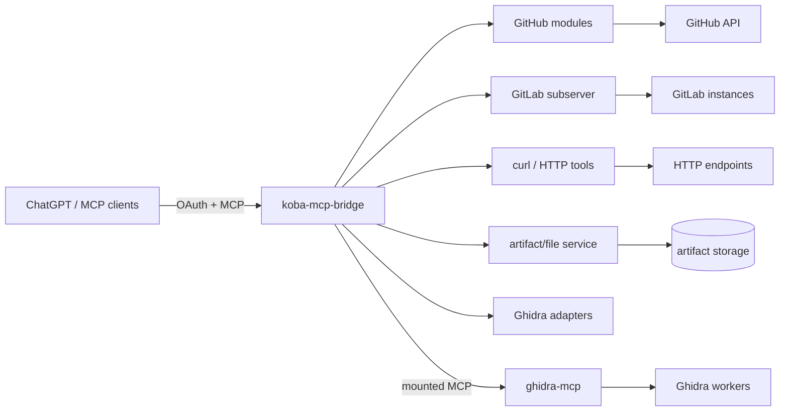
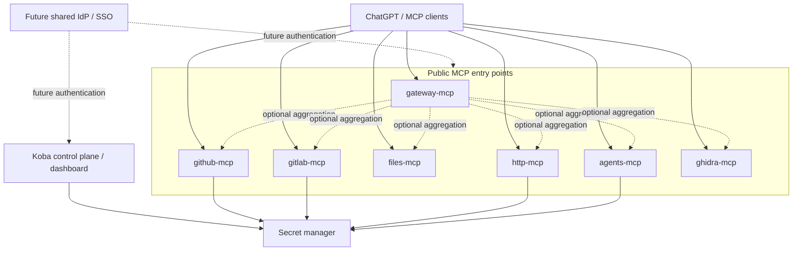

# Architecture overview

## Current state

Today, `koba-mcp-bridge` is both the public MCP gateway and the runtime for several local integration surfaces.

This model is operational, but several unrelated integration surfaces share one Python process and one deployment lifecycle. A startup or deployment regression in one surface can therefore reduce access to otherwise healthy tools.

## Direction

The target direction is a modular Koba integration platform: shared code and one repository are acceptable, but runtime failure domains should be separated.

The aggregate gateway remains useful for clients that want a broad tool catalog, but individual endpoints allow different clients or agents to attach only the capabilities they need.

## Design principles

- No process-global "current account", "current project", or "current provider" state.
- Explicit selectors such as `profile_id` and `project_id` are preferred.
- Secrets should not be stored in repository configuration or model-visible context.
- Connectors should fail independently.
- Provider-side permissions remain authoritative; Koba policy is an additional guardrail.
- Shared libraries are preferred over duplicated connector logic.
- Public names should describe user intent; internal storage terminology can remain implementation-specific.
- Documentation should describe both current state and intended boundaries until migration is complete.

## Near-term architectural questions

The repository intentionally does not finalize these decisions yet:

- secret manager selection and deployment model;
- control-plane/dashboard data model;
- common SSO/IdP adoption;
- final runtime packaging boundaries;
- whether the aggregate gateway remains enabled for all clients;
- artifact-service public naming and migration toward a Files surface;
- agent runtime boundaries;
- Camera Manager ownership and protocol model.

Each question should be resolved through a focused issue and, where architectural impact is significant, an ADR.
